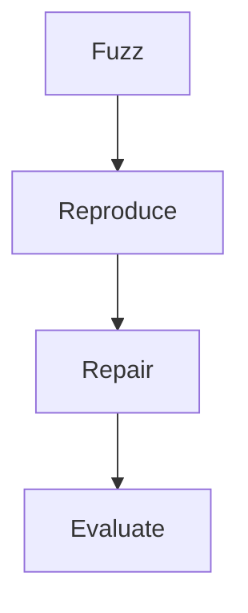
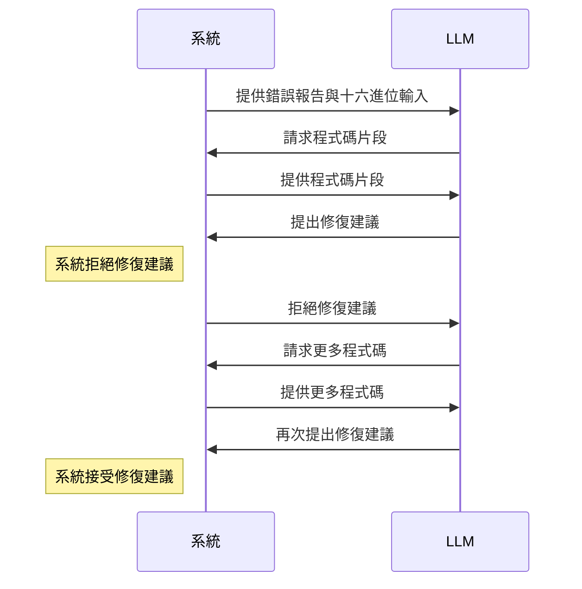

本文介紹 AFixL 的流程與使用方式。AFixL 是一款基於 AFL++ 的自動化程式修復工具，結合模糊測試與自動修復技術，協助修復 C/C++ 程式錯誤，並探討大型語言模型在對話式修復流程中處理模糊測試發現錯誤的成效。
<!--more-->

## 用戶需提供的資料

使用 AFixL 進行自動修復時，需準備以下資料：
1. **Dockerfile**：定義程式編譯與執行環境。
2. **Source code**：待修復的程式碼。
3. **Fuzz target**：模糊測試的目標程式。
4. **Evaluation set**：一組**不會** Crash 的輸入，用於評估修復效果並作為 fuzzing 種子。

## AFixL 限制

由於 AFixL 基於 AFL++，目前有以下限制：
- **僅支援 C/C++**：目前僅能修復 C/C++ 程式，因為實作依賴 Clang 與 AFL++。
- **無法修復邏輯錯誤**：僅針對如 segmentation fault、buffer overflow 等錯誤，無法處理演算法等邏輯錯誤。
- **錯誤需可重現**：需能重現錯誤，才能收集 sanitizer 報告並評估修復成效。
- **需 Docker 環境**：必須在具備 Docker 的環境下運行，以確保一致的編譯與執行環境。

## AFixL 流程

1. **fuzz**：利用模糊測試產生測試用例，觸發程式錯誤。
2. **reproduce**：重現模糊測試發現的錯誤，並取得 sanitizer 報告。
3. **repair**：透過自動化程式修復技術（APR）產生修復建議。
4. **evaluate**：評估修復後程式能否通過所有測試用例，且不再出現原錯誤。



## Fuzz 階段

Fuzz 階段使用 AFL++ 進行模糊測試，產生測試用例以觸發錯誤。指令如下：

```bash
# "--" 分隔 AFL++ 參數與目標程式參數
# "@@" 為 AFL++ 特殊符號，代表輸入檔案路徑
afl-fuzz -i inputs -o outputs -- ./fuzz_target @@
```

`inputs` 目錄需包含初始測試用例（即 Evaluation set），作為 fuzzing 種子，協助 AFL++ 產生更多測試用例。

`outputs` 目錄存放 AFL++ 產生的測試用例與結果，其中 `crashes` 目錄包含所有觸發錯誤的測試用例。

## Reproduce 階段

Reproduce 階段利用 AFL++ 產生的測試用例重現錯誤，並取得 sanitizers 報告。指令如下：

```bash
# 將 Sanitizer 報告輸出至指定檔案
export ASAN_OPTIONS="log_path=asan_report.txt"
export UBSAN_OPTIONS="log_path=ubsan_report.txt"
...

# 使用 AFL++ 測試用例重現執行
./fuzz_target outputs/crashes/...
```

AFixL 會保存重現的錯誤及相關報告，供修復階段使用。

有關 Sanitizer 的使用方法，請參考我的另一篇文章 [Sanitizers](https://nocodenolife3742.github.io/blog/sanitizers/)。

## Repair 階段

Repair 階段利用自動化程式修復技術 (APR) 來修正錯誤。本工具以大型語言模型 (LLM) 為核心，產生修復建議，協助用戶修復程式缺陷。

我們參考了 [Conversational Automated Program Repair](https://arxiv.org/abs/2301.13246) 的方法，並採用類似的對話式流程。由於 Fuzz 測試的程式規模通常較大，錯誤可能涉及多個函式，因此我們拓展了論文中的想法，讓 LLM 能主動尋找感興趣的程式碼片段，提升對程式上下文的理解，並避免單次輸入過大造成處理困難。

在修復過程中，LLM 主要有兩種操作：
1. **Request code**：請求用戶提供待修復的程式碼片段。
2. **Propose fix**：提出修復建議，並請用戶確認是否接受。

LLM 會先取得測試用例的十六進位表示及 Sanitizer 報告，再生成修復建議。以下為 LLM 提示範例：
```text
You are an expert C/C++ programmer and debugger, specializing in analyzing and fixing memory safety and undefined behavior issues. You will be given a crash report and a hex dump of the input that caused the crash. Your task is to analyze the crash report, identify the root cause, and propose a fix.

The crash report is as follows:
[Sanitizer report]

The hex dump of the input that caused the crash is as follows:
[Hex dump]

Your allowed operations are:
1. Request code: Ask the user to provide a specific code snippet related to the crash.
2. Propose fix: Suggest a code fix based on the provided crash report and hex dump.

...
```

以下為修復階段的序列圖，展示 LLM 與系統之間的互動流程 (拒絕與接受的決策是由 Evaluate 階段決定的)：



## Evaluate 階段

Evaluate 階段評估修復後的程式是否能通過所有測試用例，且不再出現原錯誤。這一階段主要檢查以下幾點：
1. **通過測試用例**：修復後的程式需能通過所有模糊測試產生的測試用例。
2. **無錯誤報告**：修復後的程式不應再出現原錯誤，且不應有新的錯誤報告。
3. **性能影響**：修復後的程式性能應與原程式相當，避免引入新的性能瓶頸，因此我們會在修復後進行性能測試。
